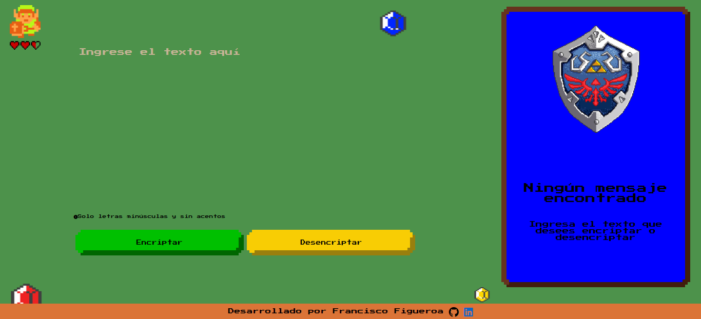

# Challenge ONE Principiante en Programación

Primer challenge de ONE ORACLE, que consiste en crear una página web que sea capaz de encriptar y desencriptar texto que sea ingresado por el usuario y mostrar el texto en la pantalla, el objetivo de este proyecto es poner a prueba los conocimientos adquiridos durante el curso "Principiante en programación".

:point_right: [Link del Proyecto](https://javierfig0.github.io/Encriptador-de-texto/) 

## :key: LLaves de encriptación

Las "llaves" de encriptación que se utilizaron son las siguientes:

- `La letra "e" es convertida para "enter"`
- `La letra "i" es convertida para "imes"`
- `La letra "a" es convertida para "ai"`
- `La letra "o" es convertida para "ober"`
- `La letra "u" es convertida para "ufat"`

## :pushpin: **Requisitos:**

- Debe funcionar solo con letras minúsculas
- No deben ser utilizados letras con acentos ni caracteres especiales
- Debe ser posible convertir una palabra para la versión encriptada también devolver una palabra encriptada para su versión original. 

Por ejemplo:

`"gato" => "gaitober"`\
`gaitober" => "gato"`

- La página debe tener campos para inserción del texto que será encriptado o desencriptado, y el usuario debe poder escoger entre las dos opciones.
- El resultado debe ser mostrado en la pantalla.

## Construido con :hammer_and_wrench:

* 
* 
* 

## :e-mail: Contacto

---

 Esta obra está bajo una <a rel="license" href="http://creativecommons.org/licenses/by-nc/4.0/">Licencia Creative Commons Atribución-NoComercial 4.0 Internacional</a>.

